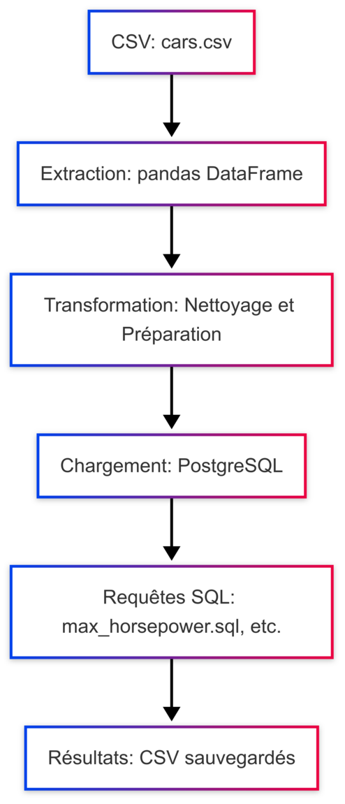

# First-Small-ETL

Un projet de pipeline ETL (Extract, Transform, Load) minimaliste conçu à des fins d'apprentissage. Ce pipeline extrait des données d'un fichier CSV contenant des informations sur des voitures, les transforme, puis les charge dans une base de données PostgreSQL. Il exécute également des requêtes SQL dynamiques et sauvegarde leurs résultats.

---

## 🚀 Fonctionnalités principales
- **Extraction** : Lecture des données à partir d'un fichier CSV (`cars.csv`) dans un DataFrame pandas.
- **Transformation** : Nettoyage et préparation des données pour le chargement (renommage, remplacement de valeurs, etc.).
- **Chargement** : Insertion des données transformées dans une table PostgreSQL.
- **Exécution de requêtes SQL** : Gestion des requêtes SQL dynamiques via des fichiers `.sql` et sauvegarde des résultats dans des fichiers CSV.

### 🛠️ Outils et technologies utilisées
- **Python** : Gestion du pipeline ETL.
- **Pandas** : Manipulation des données.
- **SQLAlchemy** : Connexion à PostgreSQL.
- **PostgreSQL** : Stockage des données.
- **dotenv** : Gestion des variables d'environnement.

---

## 🗺️ Diagramme ETL

Aperçu visuel du pipeline utilisé dans ce projet :

<div align="center">

</div>

---

## 📦 Installation

1. **Cloner le dépôt** :
   ```bash
   git clone https://github.com/Mosdef00/first-small-etl.git
   cd first-small-etl
   ```

2. **Installer les dépendances** :
   ```bash
   pip install -r requirements.txt
   ```

3. **Configurer PostgreSQL** :
   - Créez une base de données avec le nom spécifié dans votre fichier `.env`.
   - Assurez-vous que les détails de connexion dans le fichier `.env` correspondent.

4. **Ajouter les données d'entrée** :
   - Vérifiez que le fichier `data/input/cars.csv` existe et respecte la structure prévue.

---

## 🚀 Utilisation

### **Exécuter le pipeline ETL complet**
Lancez le script principal :
```bash
python src/run.py
```

### **Exécuter les étapes individuellement**
- **Extraction** : `python src/extract.py`
- **Transformation** : `python src/transform.py`
- **Chargement** : `python src/load.py`

### **Exécuter les requêtes SQL**
Utilisez `run_queries.py` pour exécuter les requêtes SQL dans `sql/` :
```bash
python src/run_queries.py
```

---

### 📊 Exemples de résultats des requêtes SQL

Voici quelques exemples de résultats attendus pour les requêtes SQL dans le pipeline :

1. **`max_horsepower.sql`** :
   Cette requête sélectionne la voiture avec la puissance maximale (`horsepower_hp`) dans la base de données.

   **Exemple de résultat** :
   ```
   | car_model        | horsepower_hp |
   |------------------|---------------|
   | Ford Mustang     | 450           |
   ```

2. **`cars_by_transmission.sql`** :
   Cette requête regroupe les voitures par type de transmission (`transmission`) et compte le nombre de voitures dans chaque catégorie.

   **Exemple de résultat** :
   ```
   | transmission | car_count |
   |--------------|-----------|
   | Manual       | 120       |
   | Automatic    | 230       |
   ```

3. **`avg_horsepower.sql`** :
   Cette requête calcule la puissance moyenne (`horsepower_hp`) des voitures en fonction du nombre de cylindres (`cylinders`).

   **Exemple de résultat** :
   ```
   | cylinders | avg_horsepower |
   |-----------|----------------|
   | 4         | 150            |
   | 6         | 200            |
   | 8         | 350            |
   ```

4. **`all_mercedes.sql`** :
   Cette requête extrait toutes les voitures de marque "Mercedes" dans la base de données.

   **Exemple de résultat** :
   ```
   | car_model        | horsepower_hp |
   |------------------|---------------|
   | Mercedes 230     | 130           |
   | Mercedes 240D    | 90            |
   | Mercedes 280     | 185           |
   ```

---

## 📂 Structure du projet

```
first-small-etl/
├── data/
│   ├── input/
│   │   └── cars.csv
│   └── assets/
|       ├── etl_diagram.md
│       └── etl_diagram.png
├── notebooks/
│   └── exploration.ipynb
├── query_results/
|   ├── max_horsepower.csv
│   ├── cars_by_transmission.csv
|   ├── all_mercedes.csv
│   └── avg_horsepower.csv
├── sql/
│   ├── max_horsepower.sql
│   ├── cars_by_transmission.sql
|   ├── all_mercedes.sql
│   └── avg_horsepower.sql
|   
├── src/
│   ├── extract.py
│   ├── transform.py
│   ├── load.py
│   ├── run.py
│   ├── run_queries.py
├── requirements.txt
├── .env
└── README.md
```

---

## 📚 Apprentissage

Ce projet m'a permis de :
- Me familiariser avec les concepts fondamentaux des pipelines ETL (Extract, Transform, Load).
- Appliquer les bibliothèques Python comme `pandas` pour la manipulation de données et `SQLAlchemy` pour interagir avec une base de données PostgreSQL.
- Comprendre l'importance de structurer les étapes d'un pipeline de données en modules séparés pour faciliter la maintenance et la réutilisation.
- Apprendre à utiliser Git et GitHub pour gérer le versionnement du code et documenter un projet de manière professionnelle.

Ces apprentissages constituent une base solide pour approfondir mes connaissances dans des outils plus avancés tels qu'Apache Airflow pour l'orchestration et Docker pour la conteneurisation.

---

## 🐾 Améliorations futures
- **Apache Airflow** : Automatiser l'orchestration du pipeline.
- **Docker** : Conteneuriser le projet pour maximiser sa portabilité.
- **Tests** : Ajouter des tests unitaires pour valider chaque étape ETL.
- **CI/CD** : Intégrer un pipeline CI/CD pour tester et déployer rapidement les améliorations.

---

## 📝 Licence
Ce projet est à des fins éducatives et est sous licence MIT.