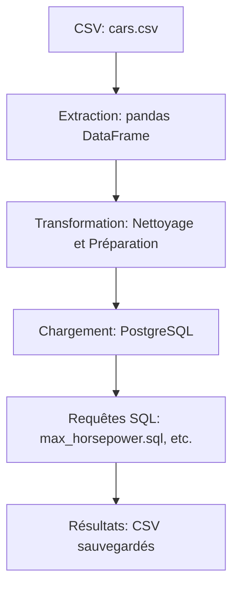

```mermaid
flowchart TB
    A[CSV: cars.csv] --> B[Extraction: pandas DataFrame]
    B --> C[Transformation: Nettoyage et Préparation]
    C --> D[Chargement: PostgreSQL]
    D --> E[Requêtes SQL: max_horsepower.sql, etc.]
    E --> F[Résultats: CSV sauvegardés]
```